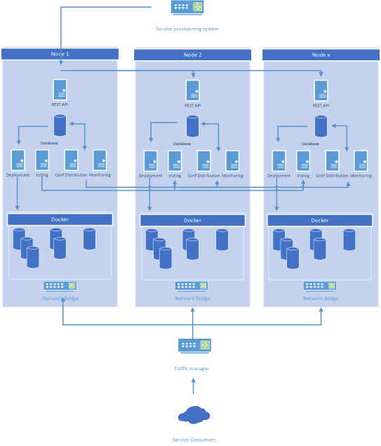

# Bicycle
Simple docker container orchestrator.

## Task
* Build your own Docker container orchestrator similar to
Swarm or Kubernetes, which deploys services as containers
and spreads the workload between number of nodes acting
as cluster.

* Cluster should expose a REST API with following endpoints:
    * **Service**
    * **State**

* The Service endpoint should take description of container
with number of replicas and cluster should deploy those on its
member-nodes. Service state should be returned as a
response to the initial request from the cluster. Execution of
containers should be spread evenly between the nodes.

* State endpoint should return JSON formatted information
about the swarm state (member nodes, services, containers,
uptimes, etc).

## Solution structure

* [Multithreaded daemon running](./docs/daemon.md)
    * [REST API interface](./docs/rest.md) - Base interface to add/modify/get info on services and nodes configuration. This interface does not deploy or delete anything but just manage records in database. Every module record represents entity acting as state machine which states are trigered by API('NEW' and 'DELETE' state), but handled by Deployment subsystem
    * [Deployment subsystem](./docs/deployment.md) - Subsystem tracking configuration changes and deploying them to local docker daemon, bootstraping of new nodes, syncing network bridge and traffic manager settings, this logic is also used to **rebalance** runing instances of active services, if some of hosts are lost
    * [Voting subsystem](./docs/voting.md) - Subsystem managing process of selection master node of cluster, used also to understand if some of hosts are lost
    * [Monitoring/Loging subsystem](./docs/logs.md) - Subsystem managing access to Monitors/Logs on service/node levels

* [CLI tool](./docs/cli.md)
* [Database](./docs/database.md)

[Solution diagram](./docs/media/architecture.vsdx)

## Code directory Structure:
* modules - directory holding classes used for REST API to handle particular modules requests
* main.py - multithreaded daemon main file
* config.json - daemon configuration in json format
* deployment_class.py - class defining methods to deploy service changes to docker daemon
* loging_class.py - class defining methods to deploy service changes to docker daemon
* voting_class.py - class defining methods in order to run subsystem selecting master node
* database_class.py - class definition for accessing data setting held in sqllite
* database.db - sqlite database holding all data, it generated on first run of daemon generating all tables structure on first request of any node
